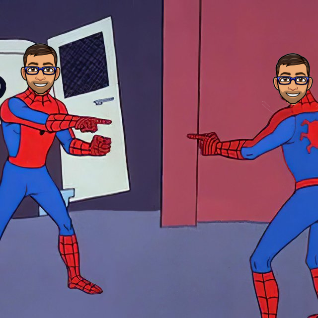

class: center
name: title
count: false

# Rust 2024 and beyond

.p60[]

.me[.grey[*by* **Nicholas Matsakis**]]
.left[.citation[View slides at `https://nikomatsakis.github.io/rustnation-24/`]]

---

# I wear many hats

---

# Rust language designer

???

Longest surviving member of Rust team

---

# Senior Principal Engineer @ Amazon 

???

Amazon is adopting Rust for many purposes

I lead Amazon's efforts to invest in Rust and support the Rust language.

I'll talk more about this.

---

# What hat am I wearing today?

All of them.

None of them.

???

I'm here giving you my personal opinion.
I won't tell you that I wear no hats.
I don't believe a person can truly take off a hat.
I don't believe you would want them to.
I'm influenced by what Amazon needs.
I'm influenced by what people at Mozilla needed.
And I'm influenced most of all by what I see that *Rust* needs.
I'll talk more about this as I go.

What I do want to be clear on, though, is that I'm going to talk about some proposals and design directions. For the most part these represent my desires and not the consensus of the Rust language design team. 

I'll be clear about it.

---

# Rust in 2024

What I see...

* GREAT OPPORTUNITY
* GREAT RISK


---

# Rust in 2024

What I see...

* GREAT OPPORTUNITY
* ~~GREAT RISK~~ SOME RISK

???

- Cut to the chase
    - What do I see for Rust?
        - I see *opportunity*
        - I also see *risk*
        - **Stability without stagnation** has never been more important
        - I'm here to talk about what I see working great, and what I see as big priorities to improve

---

# Our North Star

### Empowering everyone to build reliable, efficient, and maintainable software

--

*Design for the long term*

???

As always, Rust's north star remains empowerment 

---

# Rust's most important value?

### RELIABILITY?

--

### PERFORMANCE?

--

### ACCESSIBILITY?

---

# Rust's most important value?

--

### STABILITY *without* STAGNATION

???

These days I tend to think of *Stability without stagnation* as our ur-value.
Rust can never be perfect. 
We'll never get everything right the first time.
But as long as we persist in growing changing and innovating, we are going to be ok.

---

# Back to the axioms

| | What makes Rust *Rust*? | |
| :-- | :-- | :-- |
| ⚙️ | Reliable | |
| 🏎️ | Performant, composable abstractions | |
| 🔧 | Low-level control and transparency | |
| 🌟 | Extensible and productive | |
| 🤸🏾 | Accessible and supportive | |

.small[**NB:** Good example of where I'm speaking for myself here:<br>
    These are not "official" values of Rust, though I think they (or something like them) should be.]

---

# Iterators: performant, composable abstractions

| | What makes Rust *Rust*? | |
| :-- | :-- | :-- |
| ⚙️ | Reliable | |
| .mark[🏎️] | .mark[Performant, composable abstractions] | |
| 🔧 | Low-level control and transparency | |
| 🌟 | Extensible and productive | |
| 🤸🏾 | Accessible and supportive | |

---

# Let's tell a story


.footnote[
    Artistic credit goes to my daughter.
]

???

This is Barbara. She's a Rust programmer.

---
name: thumbnails

# Let's tell a story

```rust
fn make_thumbnails(images: &[Image]) -> Vec<Image> {
    images
        .iter()
        .map(|image| image.make_thumbnail())
        .collect()
}
```

.abspos.left30.top350[]

???

One day, Barbara is reading over some code that creates thumbnails for a vector of images in the application.

---
template: thumbnails
.arrow.abspos.left400.top90.rotSW[]

---
template: thumbnails
.line2[]

---
template: thumbnails
.line3[]

.abspos.left500.top165[
```rust
// impl Iterator<Item = &Image>
```
]

--

.arrow.abspos.left600.top145.rotS[]

--

.arrow.abspos.left730.top145.rotS[]

---
template: thumbnails
.line4[]

.abspos.left500.top195[
```rust
// impl Iterator<Item = Image>
```
]

--

.arrow.abspos.left250.top175.rotSW[]
--

.arrow.abspos.left450.top175.rotSW[]

--

.arrow.abspos.left730.top175.rotS[]

---
template: thumbnails
.line5[]

.abspos.left500.top220[
```rust
// ?
```
]

--

.arrow.abspos.left550.top150.rotNW[]

--

.abspos.left500.top220[
```rust
// Vec<Image>
```
]

---

name: make-thumbnails-at-top

```rust
fn make_thumbnails(images: &[Image]) -> Vec<Image> {
    images
        .iter()
        .map(|image| image.make_thumbnail())
        .collect()
}
```

---

template: make-thumbnails-at-top
name: with-translated-code

```rust
fn make_thumbnails(images: &[Image]) -> Vec<Image> {
    let mut i = 0;
    let l = images.len();
    let mut output = Vec::with_capacity(l);
    while i < l {
        output.push(images[i].make_thumbnail());
        i += 1;
    }
    output
}
```

---

template: with-translated-code

.arrow.abspos.left430.top300.rotSW[]

---

template: with-translated-code

.arrow.abspos.left340.top420.rotNW[]

---

```rust
fn make_thumbnails(images: &[Image]) -> Vec<Image> {
    images
        .iter()
        .map(|image| image.make_thumbnail())
        .collect()
}
```

```rust
fn make_thumbnails(images: &[Image]) -> Vec<Image> {
    let mut i = 0;
    let l = images.len();
    let mut output = Vec::with_capacity(l);
    while i < l {
        output.push(unsafe { images.get_unchecked(i).make_thumbnail() });
        i += 1;
    }
    output
}
```

.arrow.abspos.left500.top420.rotNW[]

--

.abspos.left650.top450.fliplr[]

.abspos.left300.top550[
.speech-bubble.barbara.right[
Which would *you* rather write?
]]

---

# Extensibility: minimal built-in

| | What makes Rust *Rust*? | |
| :-- | :-- | :-- |
| ⚙️ | Reliable | |
| 🏎️ | Performant, composable abstractions | |
| 🔧 | Low-level control and transparency | |
| .mark[🌟] | .mark[Extensible and productive] | |
| 🤸🏾 | Accessible and supportive | |

---

template: thumbnails

.abspos.left300.top415[
.speech-bubble.left.barbara[
*Oh hey, I could run these in parallel!*
]]

---


.footnote[
    (I am a co-maintainer, though really Josh Stone does the lion's share of the work)
]

---
name: thumbnailspar

# Parallelizing with Rayon

```rust
fn make_thumbnails(images: &[Image]) -> Vec<Image> {
    images
        .par_iter()
        .map(|image| image.make_thumbnail())
        .collect()
}
```

.abspos.left30.top350[]

.line3[]

---
template: thumbnailspar

.abspos.left300.top415[
.speech-bubble.left.barbara[
*Rayon makes this so easy!*
]]

---

# Example: Rayon

| | What makes Rust *Rust*? | |
| :-- | :-- | :-- |
| .mark[⚙️] | .mark[Reliable] | |
| 🏎️ | Performant, composable abstractions | |
| 🔧 | Low-level control and transparency | |
| 🌟 | Extensible and productive | |
| 🤸🏾 | Accessible and supportive | |

---
name: meetalan
# Adding telemetry

```rust
fn make_thumbnails(images: &[Image]) -> Vec<Image> {
    images
        .par_iter()
        .map(|image| image.make_thumbnail())
        .collect()
}
```

.abspos.left30.top350[]

.abspos.left500.top350[]

???

So some time later, Barbara has an intern Alan.

---
template: meetalan

.abspos.left300.top415[
.speech-bubble.left.barbara[
Your job is to<br>add telemetry
]]

--

.abspos.left420.top550[
.speech-bubble.right.alan[
OK!
]]

???

Alan's job is to add telemetry to this product.
In particular, they want to count how many thumbnails they made.

---
name: thumbnailsbug

# Let's tell a story

```rust
fn make_thumbnails(images: &[Image]) -> Vec<Image> {
    let mut counter = 0;
    let vec = images
        .par_iter()
        .map(|image| {
            counter += 1; 
            image.make_thumbnail()
        })
        .collect();
    log(counter);
    vec
}
```

.abspos.left500.top350[]

???

So some time later, Barbara has an intern Alan.
Alan's job is to add telemetry to this product.
In particular, they want to count how many thumbnails they made.

---
template: thumbnailsbug

.line2[]

.abspos.left170.top475[
.speech-bubble.right.alan[
Let's see, I'll need a counter...
]]

---
template: thumbnailsbug

.line6[]

.abspos.left170.top475[
.speech-bubble.right.alan[
...add 1 for each image...
]]

---
template: thumbnailsbug

.line10[]

.abspos.left170.top475[
.speech-bubble.right.alan[
...and log it for telemetry. Done!
]]

---
template: thumbnailsbug

.abspos.left250.top350.fliplr[]

.abspos.left280.top440[
.thought.barbara.bubble1[&nbsp;]
]

.abspos.left310.top410[
.thought.barbara.bubble2[&nbsp;]
]

.abspos.left340.top390[
.thought.barbara.bubble3[&nbsp;]
]

.abspos.left25.top475[
.speech-bubble.barbara[
*I'm ready for lunch.*
]]

--

.abspos.left25.top570[
.speech-bubble.barbara.right[
Looks great! Ship it!
]]

--

.line6[]

---
.page-center[

]

---
template: thumbnailsbug

.line10[]

.abspos.left170.top475[
.speech-bubble.right.alan[
...and log it for telemetry. Done!
]]

---
template: thumbnailsbug
name: thumbnailsbugferris

.line6[]

.abspos.left235.top320.p60[

]

.abspos.left25.top540[
.speech-bubble.topright.ferris[
Hold up there buddy!<br>
This could cause a data race!
]]

---
template: thumbnailsbug

.line6[]

.abspos.left235.top320.p60[

]

.abspos.left150.top570[
.speech-bubble.right.alan[
Gee, thanks Ferris! My hero!
]]

---
.page-center[

]

---

template: thumbnailsbug

.line6[]

.abspos.left235.top320.p60[

]

.abspos.left25.top540[
.speech-bubble.topright.ferris[
    Cannot assign to `counter`, as it is a<br>
    captured variable in a `Fn` closure
]]


---
template: thumbnailsbug
name: stupid-compiler

.abspos.left500.top350[]

---
template: stupid-compiler

.abspos.left350.top475[
.speech-bubble.right.alan[
Stupid compiler.
]]

.abspos.left300.top580[
.speech-bubble.right.alan[
Help me!
]]

---
template: stupid-compiler

.abspos.left250.top350.fliplr[]

.abspos.left75.top475[
.speech-bubble.barbara.right[
Ah, yeah, this.<br>
Use `AtomicUsize`.
]]


---
name: thumbnailsfixed

# Let's tell a story

```rust
fn make_thumbnails(images: &[Image]) -> Vec<Image> {
    let counter = AtomicUsize::new();
    let vec = images
        .par_iter()
        .map(|image| {
            counter.fetch_add(1, Ordering::SeqCst);
            image.make_thumbnail()
        })
        .collect();
    log(counter.load(Ordering::SeqCst));
    vec
}
```

.abspos.left500.top350[]

---
template: thumbnailsfixed

.line2[]

---
template: thumbnailsfixed

.line6[]

---
template: thumbnailsfixed

.line10[]

---
template: thumbnailsfixed

.abspos.left320.top470[
.speech-bubble.right.alan[
Welp, now I know!
]]

--

.abspos.left200.top200[
.p100[]
]

---

# Hack without fear

> Rust lets you hack without fear.<br>
> <br>
> — Felix Klock, years back

---

# Just a story...?

--

.center[
.p60[]
]

---

# Let's talk about THE FUTURE


.footnote["Be excellent to each other."]

--

## `std::future::Future`, that is

---

# Async Rust

| | What makes Rust *Rust*? | |
| :-- | :-- | :-- |
| ⚙️ | Reliable | |
| .mark[🏎️] | .mark[Performant, composable abstractions] | |
| 🔧 | Low-level control and transparency | |
| 🌟 | Extensible and productive | |
| 🤸🏾 | Accessible and supportive | |

---

# Async Rust can be so very cool

It's also a bit different than async/await in other languages.

---

# Async in JavaScript starts a task

```js
async function process_row(row) { 
    /* do some really smart stuff */
}

let promise = process_row(row);
```

.abspos.left755.top115.width100[]

.abspos.left600.top350[]

.abspos.left350.top400[
.speech-bubble.alan.right[
In JavaScript, calling an<br>
async functions<br>
starts a task.
]]

.abspos.left50.top350.bgactive.padding20[
    Task A
]

--

.abspos.left10.top230.width50[]

--

.abspos.left200.top350.bgactive.padding20[
    Task B
]

---

# Await in JavaScript waits for the task

```js
async function process_row(row) { 
    /* do some really smart stuff */
}

let promise = process_row(row);
let result = await promise;
```

.abspos.left755.top115.width100[]

.abspos.left600.top350[]

.abspos.left350.top400[
.speech-bubble.alan.right[
When I use await,<br>
I pause my task until<br>
the other task finishes.
]]

.abspos.left50.top350.bgactive.padding20[
    Task A
]

.abspos.left50.top470.width75.height10.bgsuspended.padding20[
    
]

.abspos.left200.top350.bgactive.padding20[
    Task B
]

.abspos.left10.top260.width50[]

--

.abspos.left200.top475.huge[↵] 

.abspos.left50.top520.bgactive.padding20[
    Task A
]

---

# Core idea: future

```rust
async fn process_row(row: Row) -> Result {
    /* do some really smart stuff */
}

let future = process_row(row);
```

.abspos.left0.top350[]

.abspos.left240.top400[
.speech-bubble.barbara.left.medium[
    In Rust, an `async fn`<br>
    returns a **future**,<br>
    a bit of **suspended code**.
]]

--

.abspos.left550.top400.width70.bgactive.padding10.medium[
    Task A
]

--

.arrow.abspos.left10.top230[]

--

.abspos.left650.top400.bgfuture.padding10.medium.rounded_corners[
    `process_row(row)`
]


---

# Core idea: future

```rust
async fn process_row(row: Row) -> Result {
    /* do some really smart stuff */
}

let future = process_row(row);
let result = future.await;
```


.abspos.left0.top350[]

.abspos.left240.top400[
.speech-bubble.barbara.left.medium[
**Awaiting** a future<br>
makes the current task<br>
execute the future
]]

.abspos.left550.top400.width70.bgactive.padding10.medium[
    Task A
]

.abspos.left650.top400.bgfuture.padding10.medium.rounded_corners[
    `process_row(row)`
]

--

.arrow.abspos.left10.top260[]

--

.abspos.left550.top480.width70.bgactive.padding10.medium[
    .await
]

.abspos.left630.top475.rotSW.huge[⇗] 

---

name: compose

# You can build bigger futures

```rust
async fn process_row(row: Row) -> Result {
    /* do some really smart stuff */
}

let future1 = process_row(row1);
let future2 = process_row(row2);
let future3 = join!(future1, future2);
```

.abspos.left0.top350[]

.abspos.left240.top400[
.speech-bubble.barbara.left.medium[
This design lets you<br>
**compose** futures<br>
into bigger ones,<br>
without having to<br>
spawn a task for<br>
each each piece.<br>
]]

---
template: compose

.abspos.left650.top450.bgfuture.padding10.medium.rounded_corners[
    `process_row(row1)`
]

.arrow.abspos.left10.top230[]

---
template: compose


.abspos.left650.top450.bgfuture.padding10.medium.rounded_corners[
    `process_row(row1)`
]

.abspos.left650.top550.bgfuture.padding10.medium.rounded_corners[
    `process_row(row2)`
]

.arrow.abspos.left10.top260[]

---
template: compose

.abspos.left630.top370.width210.height270.bgfuture1.padding10.medium.rounded_corners[
    `joined future`
]

.abspos.left650.top450.bgfuture.padding10.medium.rounded_corners[
    `process_row(row1)`
]

.abspos.left650.top550.bgfuture.padding10.medium.rounded_corners[
    `process_row(row2)`
]

.arrow.abspos.left10.top290[]

---

# You can build bigger futures

```rust
async fn process_row(row: Row) -> Result {
    /* do some really smart stuff */
}

let future1 = process_row(row1);
let future2 = process_row(row2);
let future3 = join!(future1, future2);
future3.await
```

.abspos.left0.top350[]

.abspos.left240.top400[
.speech-bubble.barbara.left.medium[
Awaiting will<br>
process the<br>
two rows<br>
concurrently.
]]

.abspos.left630.top370.width210.height270.bgfuture1.padding10.medium.rounded_corners[
    `joined future`
]

.abspos.left650.top450.bgfuture.padding10.medium.rounded_corners[
    `process_row(row1)`
]

.abspos.left650.top550.bgfuture.padding10.medium.rounded_corners[
    `process_row(row2)`
]

.arrow.abspos.left10.top320[]

.abspos.left480.top400.width70.bgactive.padding10.medium[
    Task A
]

.abspos.left480.top480.width70.bgactive.padding10.medium[
    .await
]

.abspos.left570.top465.huge[⇒] 

---
name: scaling-up-to-streams

# Scaling up to streams

```rust
async fn batch_job(db: &Database) {
    let work = run_query(db, FIND_WORK_QUERY).await;
    let work_queries = stream::iter(work)
        .map(|item| run_query(db, work_query(item)))
        .buffered(5);
    while let Some(result) = work_queries.iter().next().await {
        upload_result(result).await;
    }
}
```

---

template: scaling-up-to-streams

.arrow.abspos.left10.top150[]

---

template: scaling-up-to-streams

.arrow.abspos.left10.top180[]

---

template: scaling-up-to-streams

.arrow.abspos.left10.top210[]

---

template: scaling-up-to-streams

.arrow.abspos.left10.top240[]

---

template: scaling-up-to-streams

.arrow.abspos.left10.top270[]

---

template: scaling-up-to-streams

.abspos.left600.top350.fliplr[]

.abspos.left350.top400[
.speech-bubble.barbara.right.medium[
Dang! It's *so* cool<br>
to express complex<br>
control-flow so compactly.
]]

---

# Async Rust gives low-level control

| | What makes Rust *Rust*? | |
| :-- | :-- | :-- |
| ⚙️ | Reliable | |
| 🏎️ | Performant, composable abstractions | |
| 🔧 | .mark[Low-level control and transparency] | |
| 🌟 | Extensible and productive | |
| 🤸🏾 | Accessible and supportive | |

---

# Embassy

> Rust's async/await allows for unprecedently easy and efficient multitasking in embedded systems. [..] **It obsoletes the need for a traditional \[Real-time operating system]** with kernel context switching, and is faster and smaller than one!

from https://embassy.dev/

---

# But Async Rust has some gaps

| | What makes Rust *Rust*? | |
| :-- | :-- | :-- |
| .mark[⚙️] | .mark[Reliable] | |
| 🏎️ | Performant, composable abstractions | |
| 🔧 | Low-level control and transparency | |
| 🌟 | Extensible and productive | |
| 🤸🏾 | Accessible and supportive | |

---

name: bbbs

# But Async Rust has some gaps

```rust
async fn batch_job(db: &Database) {
    let work = run_query(db, FIND_WORK_QUERY).await;
    let work_queries = stream::iter(work)
        .map(|item| run_query(db, work_query(item)))
        .buffered(5);
    while let Some(result) = work_queries.iter().next().await {
        upload_result(result).await;
    }
}
```

.abspos.left600.top350.fliplr[]

.abspos.left450.top400[
.speech-bubble.barbara.right.medium[
Why do<br>
my connections<br>
keep timing out?
]]

---

template: bbbs

.line3[]

.abspos.left50.top430.width180.height80.bgactive.center[
    Task
]

.abspos.left300.top505.bgfuture.padding10.medium.rounded_corners[
    `work_queries`
]

---

template: bbbs

.line6[]

.abspos.left50.top430.width180.height80.bgactive.center[
    Task
]

.abspos.left50.top510.width180.height80.bgsuspended.center[
    next().await
]

.abspos.left300.top505.bgfuture.padding10.medium.rounded_corners[
    `work_queries`
]

.abspos.left220.top490.huge[⇒] 

---

template: bbbs

.line7[]

.abspos.left50.top430.width180.height80.bgactive.center[
    Task
]

.abspos.left50.top510.width180.height80.bgsuspended.center[
    next().await
]

.abspos.left50.top590.width180.height80.bgsuspended.center[
    (await)
]

.abspos.left300.top505.bgfuture.padding10.medium.rounded_corners[
    `work_queries`
]

.abspos.left300.top590.bgfuture.padding10.medium.rounded_corners[
    `upload_result(result)`
]

.abspos.left220.top570.huge[⇒] 

---

# If it compiles, it works?

With Async Rust, not as often as we'd like:

* Nested awaits
* Unexpected cancellation
* Misuse of `select!`
* Uninitialized or mixed executors

Want to read more?

* [Stories submitted to the wg-async vision doc](https://rust-lang.github.io/wg-async/vision/submitted_stories/)
    * especially [Barbara battles buffered streams](https://rust-lang.github.io/wg-async/vision/submitted_stories/status_quo/barbara_battles_buffered_streams.html)
* Tyler Mandry's "for await" [blog post](https://tmandry.gitlab.io/blog/posts/for-await-buffered-streams/)
* Tomaka's [A look back at asynchronous Rust](https://tomaka.medium.com/a-look-back-at-asynchronous-rust-d54d63934a1c)

.left[.citation[Remember, you can slides at `https://nikomatsakis.github.io/rustnation-24/` and from there you can click the links]]

---

# Async Rust roadmap

| Year | Language |
| ---  | :-- |
| 2019 | Async-await MVP |

--
| 2023 | Async fn in traits, TAIT |
| 2024 | Async closures |


---

# Async Rust roadmap

| Year | Language | Ecosystem |
| ---  | :-- | :-- |
| 2019 | Async-await MVP |  |
| 2019-2023 | | core runtimes, rudiments |
| 2023 | Async fn in traits | 
| 2024 | Async closures | 

---

# Where else can we do better on reliability?

| | What makes Rust *Rust*? | |
| :-- | :-- | :-- |
| .mark[⚙️] | .mark[Reliable] | |
| 🏎️ | Performant, composable abstractions | |
| 🔧 | Low-level control and transparency | |
| 🌟 | Extensible and productive | |
| 🤸🏾 | Accessible and supportive | |

---

# cve-rs

How many of you saw [cve-rs](https://github.com/Speykious/cve-rs)?


---

# Delivering on our core promise

* New trait solver:
    * unblocks bug fixes

--
* Spec work:
    * Ferrocene open-sourced their spec
    * building on that to create an official Rust spec

--
* Developing Rust solvers
    * Stable MIR
    * [Kani](https://model-checking.github.io/kani-verifier-blog/2023/08/03/turbocharging-rust-code-verification.html)
        * [Cruesot](https://github.com/creusot-rs/creusot)

---

# Where I hope we get to


--

.abspos.top620.left450.width200.height50.bgred.center[]

---

# Where I hope we get to

---

# I want to focus on these

| | What makes Rust *Rust*? | |
| :-- | :-- | :-- |
| ⚙️ | ~~Reliable~~ | ✅ |
| 🏎️ | ~~Performant~~ | ✅ |
| 🔍 | ~~Transparent and Tunable~~ | ✅ |
| .mark[🔧] | .mark[**Extensible and Productive**] | 👈🏽 |
| 🤸🏾 | Accessible |  ⬅️ |

---

# Proc macros, custom derive are so cool

---

# But also so limited

---

# Custom diagnostics

---

# Custom lints

---

# Custom refactorings??

---

# I want to focus on these

| | What makes Rust *Rust*? | |
| :-- | :-- | :-- |
| ⚙️ | ~~Reliable~~ | ✅ |
| 🏎️ | ~~Performant~~ | ✅ |
| 🔍 | ~~Transparent and Tunable~~ | ✅ |
| 🔧 | ~~Extensible and Productive~~ | ✅ |
| .mark[🤸🏾] | .mark[**Accessible**] | 👈🏽 |

---

# Accessible

Not the language.

Always room to do more.

---

# Accessible
