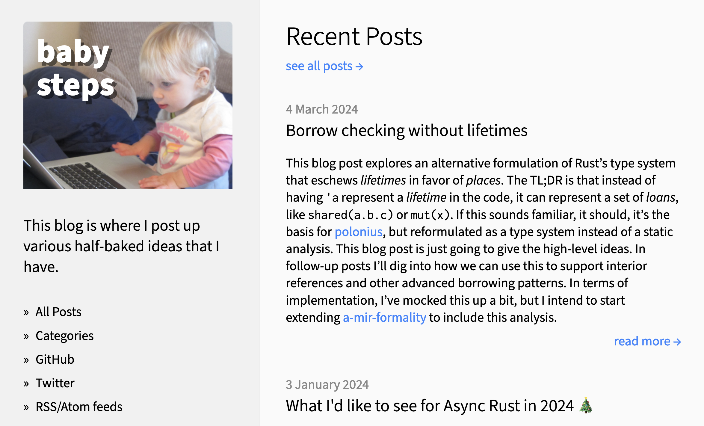
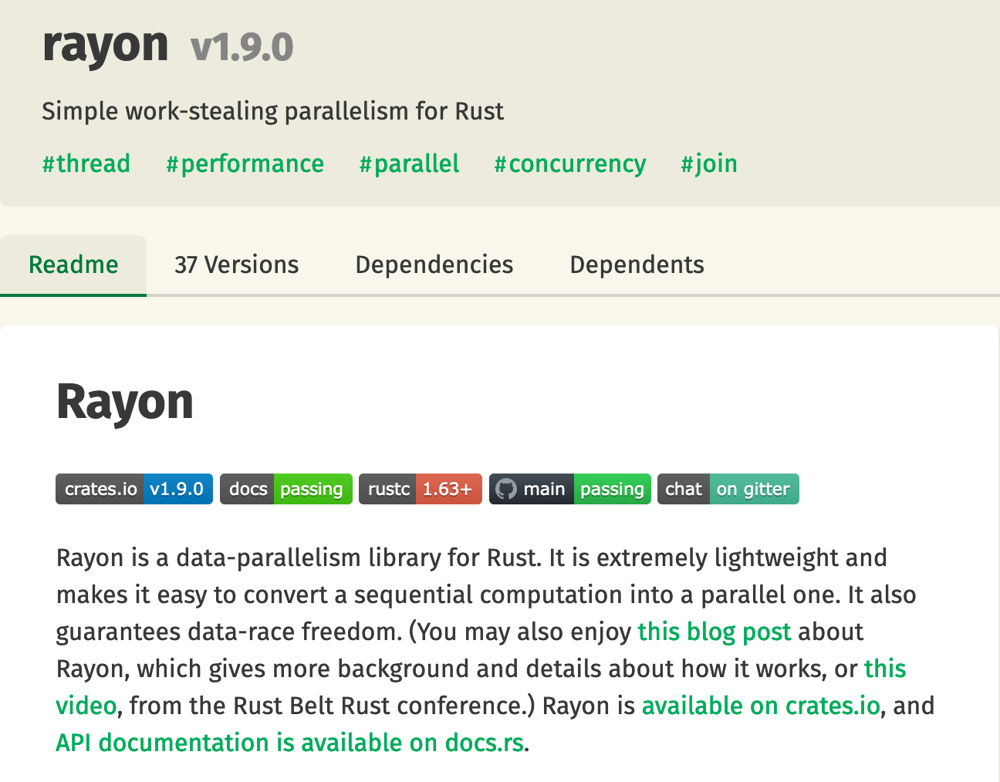
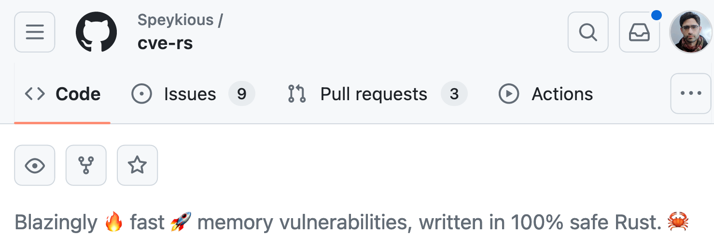
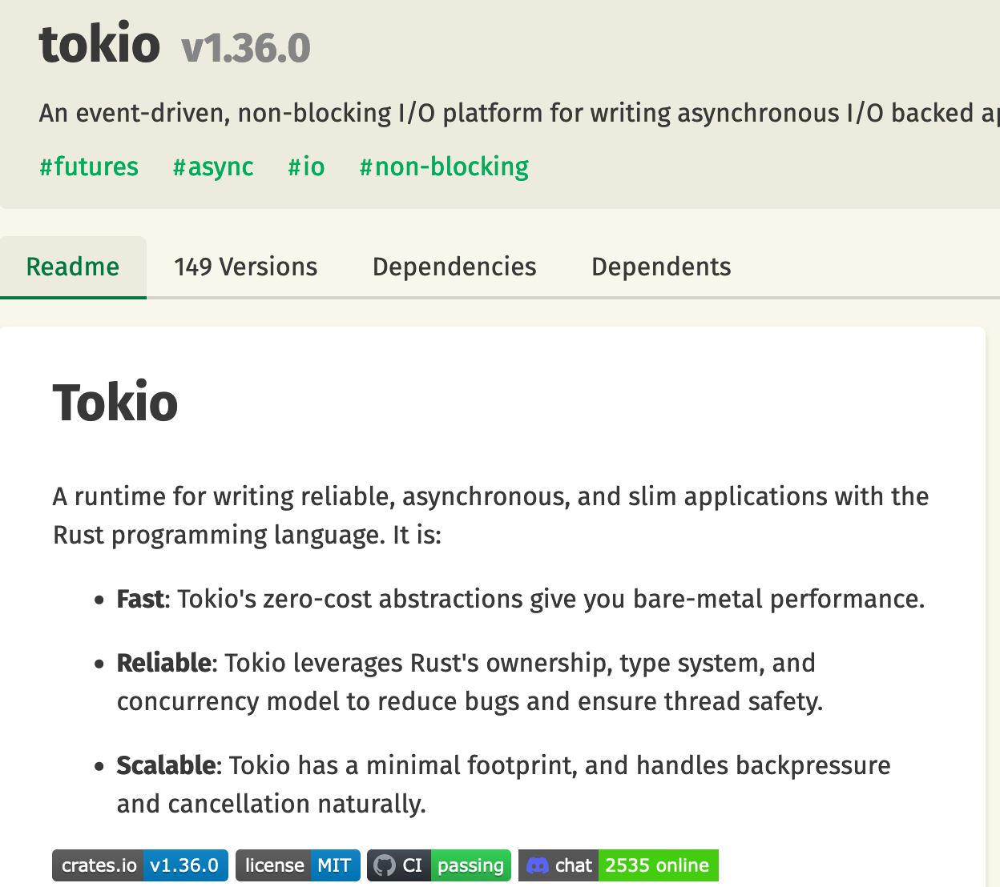
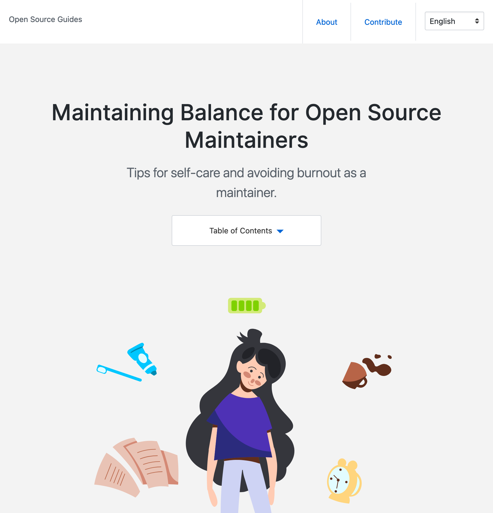

class: center
name: title
count: false

# Rust 2024 and beyond

.p60[]

.me[.grey[*by* **Nicholas Matsakis**]]
.left[.citation[View slides at `https://nikomatsakis.github.io/rustnation-24/`]]

---

# I wear many hats

???

So, yeah, who am I? 

I am I believe the longest surviving member of the Rust team, having been continuously involved since 2011.
Though there are some other folks here today -- hi Eric! -- who were around at that time, but who left in the middle.

---

# Rust language designer¹

.footnote[¹ Shoutout to Tyler Mandry, Rust language design team co-lead, and Josh Triplett, fellow lang team member, both here today.]

???

I've been involved in the design of the language for a long time, and I currently co-lead the language design team, along with Tyler Mandry (also here today!).

---

# Senior Principal Engineer @ Amazon 

???

Amazon is adopting Rust for many purposes

I lead Amazon's efforts to invest in Rust and support the Rust language.

I'll talk more about this.

---

# Bursty blogger



---

# What hat am I wearing today?

All of them.

None of them.

???

I'm here giving you my personal opinion.
I won't tell you that I wear no hats.
I don't believe a person can truly take off a hat.
I don't believe you would want them to.
I'm influenced by what Amazon needs.
I'm influenced by what people at Mozilla needed.
And I'm influenced most of all by what I see that *Rust* needs.
I'll talk more about this as I go.

What I do want to be clear on, though, is that I'm going to talk about some proposals and design directions. For the most part these represent my desires and not the consensus of the Rust language design team. 

I'll be clear about it.

---

# Rust in 2024

What I see...

* GREAT OPPORTUNITY
* GREAT RISK


---

# Rust in 2024

What I see...

* GREAT OPPORTUNITY
* ~~GREAT RISK~~ SOME RISK

???

- Cut to the chase
    - What do I see for Rust?
        - I see *opportunity*
        - I also see *risk*
        - **Stability without stagnation** has never been more important
        - I'm here to talk about what I see working great, and what I see as big priorities to improve

---

# Our North Star

### Empowering everyone to build reliable, efficient, and maintainable software

--

*Design for the long term*

???

As always, Rust's north star remains empowerment 

---

# Rust's most important value?

### RELIABILITY?

--

### PERFORMANCE?

--

### PRODUCTIVITY?

---

# Rust's most important value?

### STABILITY *without* STAGNATION

???

These days I tend to think of *Stability without stagnation* as our ur-value.
Rust can never be perfect. 
We'll never get everything right the first time.
But as long as we persist in growing changing and innovating, we are going to be ok.

---

# Rust 2024 is coming!

"Breaking changes where no code breaks..."

.footnote[
    [Watch the video.](https://www.youtube.com/watch?v=q0aNduqb2Ro)
]

---

# What makes Rust *Rust*?

--

| | What makes Rust *Rust*? | |
| :-- | :-- | :-- |
| ⚙️ | Reliable | |
| 🏎️ | Performant, composable abstractions | |
| 🔧 | Low-level control and transparency | |
| 🌟 | Extensible and productive | |
| 🤸🏾 | Accessible and supportive | |

.small[**NB:** Good example of where I'm speaking for myself here:<br>
    These are not "official" values of Rust, though I think they (or something like them) should be.]

--

.abspos.top260.left515[¹]

.footnote[¹ Check out Andres's talk on Easy Mode Rust! (Also thanks Andres for *This Week in Rust*!)]

---

# Iterators: performant, composable abstractions

| | What makes Rust *Rust*? | |
| :-- | :-- | :-- |
| ⚙️ | Reliable | |
| .mark[🏎️] | .mark[Performant, composable abstractions] | |
| 🔧 | Low-level control and transparency | |
| 🌟 | Extensible and productive | |
| 🤸🏾 | Accessible and supportive | |

---

# Let's tell a story


.footnote[
    Artistic credit goes to my daughter.
]

???

This is Barbara. She's a Rust programmer.

---
name: thumbnails

# Let's tell a story

```rust
fn make_thumbnails(images: &[Image]) -> Vec<Image> {
    images
        .iter()
        .map(|image| image.make_thumbnail())
        .collect()
}
```

.abspos.left30.top350[]

???

One day, Barbara is reading over some code that creates thumbnails for a vector of images in the application.

---
template: thumbnails
.arrow.abspos.left400.top90.rotSW[]

---
template: thumbnails
.line2[]

---
template: thumbnails
.line3[]

.abspos.left500.top165[
```rust
// impl Iterator<Item = &Image>
```
]

--

.arrow.abspos.left600.top145.rotS[]

--

.arrow.abspos.left730.top145.rotS[]

---
template: thumbnails
.line4[]

.abspos.left500.top195[
```rust
// impl Iterator<Item = Image>
```
]

--

.arrow.abspos.left250.top175.rotSW[]
--

.arrow.abspos.left450.top175.rotSW[]

--

.arrow.abspos.left730.top175.rotS[]

---
template: thumbnails
.line5[]

.abspos.left500.top220[
```rust
// ?
```
]

--

.arrow.abspos.left550.top150.rotNW[]

--

.abspos.left500.top220[
```rust
// Vec<Image>
```
]

---

name: make-thumbnails-at-top

```rust
fn make_thumbnails(images: &[Image]) -> Vec<Image> {
    images
        .iter()
        .map(|image| image.make_thumbnail())
        .collect()
}
```

---

template: make-thumbnails-at-top
name: with-translated-code

```rust
fn make_thumbnails(images: &[Image]) -> Vec<Image> {
    let mut i = 0;
    let l = images.len();
    let mut output = Vec::with_capacity(l);
    while i < l {
        output.push(images[i].make_thumbnail());
        i += 1;
    }
    output
}
```

---

template: with-translated-code

.arrow.abspos.left430.top300.rotSW[]

---

template: with-translated-code

.arrow.abspos.left340.top420.rotNW[]

---

```rust
fn make_thumbnails(images: &[Image]) -> Vec<Image> {
    images
        .iter()
        .map(|image| image.make_thumbnail())
        .collect()
}
```

```rust
fn make_thumbnails(images: &[Image]) -> Vec<Image> {
    let mut i = 0;
    let l = images.len();
    let mut output = Vec::with_capacity(l);
    while i < l {
        output.push(unsafe { images.get_unchecked(i).make_thumbnail() });
        i += 1;
    }
    output
}
```

.arrow.abspos.left500.top420.rotNW[]

--

.abspos.left650.top450.fliplr[]

.abspos.left300.top550[
.speech-bubble.barbara.right[
Which would *you* rather write?
]]

---

# Extensibility: minimal built-in

| | What makes Rust *Rust*? | |
| :-- | :-- | :-- |
| ⚙️ | Reliable | |
| 🏎️ | Performant, composable abstractions | |
| 🔧 | Low-level control and transparency | |
| .mark[🌟] | .mark[Extensible and productive] | |
| 🤸🏾 | Accessible and supportive | |

---

template: thumbnails

.abspos.left300.top415[
.speech-bubble.left.barbara[
*Oh hey, I could run these in parallel!*
]]

---



.footnote[
    (I am a co-maintainer, though really Josh Stone does the lion's share of the work)
]

---
name: thumbnailspar

# Parallelizing with Rayon

```rust
fn make_thumbnails(images: &[Image]) -> Vec<Image> {
    images
        .par_iter()
        .map(|image| image.make_thumbnail())
        .collect()
}
```

.abspos.left30.top350[]

.line3[]

---
template: thumbnailspar

.abspos.left300.top415[
.speech-bubble.left.barbara[
*Rayon makes this so easy!*
]]

---

# Example: Rayon

| | What makes Rust *Rust*? | |
| :-- | :-- | :-- |
| .mark[⚙️] | .mark[Reliable] | |
| 🏎️ | Performant, composable abstractions | |
| 🔧 | Low-level control and transparency | |
| 🌟 | Extensible and productive | |
| 🤸🏾 | Accessible and supportive | |

---
name: meetalan
# Adding telemetry

```rust
fn make_thumbnails(images: &[Image]) -> Vec<Image> {
    images
        .par_iter()
        .map(|image| image.make_thumbnail())
        .collect()
}
```

.abspos.left30.top350[]

.abspos.left500.top350[]

???

So some time later, Barbara has an intern Alan.

---
template: meetalan

.abspos.left300.top415[
.speech-bubble.left.barbara[
Your job is to<br>add telemetry
]]

--

.abspos.left420.top550[
.speech-bubble.right.alan[
OK!
]]

???

Alan's job is to add telemetry to this product.
In particular, they want to count how many thumbnails they made.

---
name: thumbnailsbug

# Let's tell a story

```rust
fn make_thumbnails(images: &[Image]) -> Vec<Image> {
    let mut counter = 0;
    let vec = images
        .par_iter()
        .map(|image| {
            counter += 1; 
            image.make_thumbnail()
        })
        .collect();
    log(counter);
    vec
}
```

.abspos.left500.top350[]

???

So some time later, Barbara has an intern Alan.
Alan's job is to add telemetry to this product.
In particular, they want to count how many thumbnails they made.

---
template: thumbnailsbug

.line2[]

.abspos.left170.top475[
.speech-bubble.right.alan[
Let's see, I'll need a counter...
]]

---
template: thumbnailsbug

.line6[]

.abspos.left170.top475[
.speech-bubble.right.alan[
...add 1 for each image...
]]

---
template: thumbnailsbug

.line10[]

.abspos.left170.top475[
.speech-bubble.right.alan[
...and log it for telemetry. Done!
]]

---
template: thumbnailsbug

.abspos.left250.top350.fliplr[]

.abspos.left280.top440[
.thought.barbara.bubble1[&nbsp;]
]

.abspos.left310.top410[
.thought.barbara.bubble2[&nbsp;]
]

.abspos.left340.top390[
.thought.barbara.bubble3[&nbsp;]
]

.abspos.left25.top475[
.speech-bubble.barbara[
*I'm ready for lunch.*
]]

--

.abspos.left25.top570[
.speech-bubble.barbara.right[
Looks great! Ship it!
]]

--

.line6[]

---
.page-center[

]

---
template: thumbnailsbug

.line10[]

.abspos.left170.top475[
.speech-bubble.right.alan[
...and log it for telemetry. Done!
]]

---
template: thumbnailsbug
name: thumbnailsbugferris

.line6[]

.abspos.left235.top320.p60[

]

.abspos.left25.top540[
.speech-bubble.topright.ferris[
Hold up there buddy!<br>
This could cause a data race!
]]

---
template: thumbnailsbug

.line6[]

.abspos.left235.top320.p60[

]

.abspos.left150.top570[
.speech-bubble.right.alan[
Gee, thanks Ferris! My hero!
]]

---
.page-center[

]

---

template: thumbnailsbug

.line6[]

.abspos.left235.top320.p60[

]

.abspos.left25.top540[
.speech-bubble.topright.ferris[
    Cannot assign to `counter`, as it is a<br>
    captured variable in a `Fn` closure
]]


---
template: thumbnailsbug
name: stupid-compiler

.abspos.left500.top350[]

---
template: stupid-compiler

.abspos.left350.top475[
.speech-bubble.right.alan[
Stupid compiler.
]]

.abspos.left300.top580[
.speech-bubble.right.alan[
Help me!
]]

---
template: stupid-compiler

.abspos.left250.top350.fliplr[]

.abspos.left75.top475[
.speech-bubble.barbara.right[
Ah, yeah, this.<br>
Use `AtomicUsize`.
]]


---
name: thumbnailsfixed

# Let's tell a story

```rust
fn make_thumbnails(images: &[Image]) -> Vec<Image> {
    let counter = AtomicUsize::new();
    let vec = images
        .par_iter()
        .map(|image| {
            counter.fetch_add(1, Ordering::SeqCst);
            image.make_thumbnail()
        })
        .collect();
    log(counter.load(Ordering::SeqCst));
    vec
}
```

.abspos.left500.top350[]

---
template: thumbnailsfixed

.line2[]

---
template: thumbnailsfixed

.line6[]

---
template: thumbnailsfixed

.line10[]

---
template: thumbnailsfixed

.abspos.left320.top470[
.speech-bubble.right.alan[
Welp, now I know!
]]

--

.abspos.left200.top200[
.p100[]
]

---

# Hack without fear

> Rust lets you hack without fear.<br>
> <br>
> — Felix Klock, years back

---

# Hack without fear

> We had a lot of ideas to improve performance, but we were hesitant to introduce them into critical systems given the risk of subtle bugs.<br><br>
>
> With Rust, we achieved up to double-digit percentage performance improvements. Rust’s type system provides a structure which we used to safely optimize our code.<br><br>
>
> — Seth Markle, Senior Principal Engineer, S3

---

# Let's talk about THE FUTURE


--

## `std::future::Future`, that is

---

# Async Rust

| | What makes Rust *Rust*? | |
| :-- | :-- | :-- |
| ⚙️ | Reliable | |
| .mark[🏎️] | .mark[Performant, composable abstractions] | |
| 🔧 | Low-level control and transparency | |
| 🌟 | Extensible and productive | |
| 🤸🏾 | Accessible and supportive | |

---

# Async Rust can be so very cool

It's also a bit different than async/await in other languages.

---

# Async in JavaScript starts a task

```js
async function process_row(row) { 
    /* do some really smart stuff */
}

let promise = process_row(row);
```

.abspos.left755.top115.width100[]

.abspos.left600.top350[]

.abspos.left350.top400[
.speech-bubble.alan.right[
In JavaScript, calling an<br>
async functions<br>
starts a task.
]]

.abspos.left50.top350.bgactive.padding20[
    Task A
]

--

.abspos.left10.top230.width50[]

--

.abspos.left200.top350.bgactive.padding20[
    Task B
]

---

# Await in JavaScript waits for the task

```js
async function process_row(row) { 
    /* do some really smart stuff */
}

let promise = process_row(row);
let result = await promise;
```

.abspos.left755.top115.width100[]

.abspos.left600.top350[]

.abspos.left350.top400[
.speech-bubble.alan.right[
When I use await,<br>
I pause my task until<br>
the other task finishes.
]]

.abspos.left50.top350.bgactive.padding20[
    Task A
]

.abspos.left50.top470.width75.height10.bgsuspended.padding20[
    
]

.abspos.left200.top350.bgactive.padding20[
    Task B
]

.abspos.left10.top260.width50[]

--

.abspos.left200.top475.huge[↵] 

.abspos.left50.top520.bgactive.padding20[
    Task A
]

---

# Core idea: future

```rust
async fn process_row(row: Row) -> Result {
    /* do some really smart stuff */
}

let future = process_row(row);
```

.abspos.left0.top350[]

.abspos.left240.top400[
.speech-bubble.barbara.left.medium[
    In Rust, an `async fn`<br>
    returns a **future**,<br>
    a bit of **suspended code**.
]]

--

.abspos.left550.top400.width70.bgactive.padding10.medium[
    Task A
]

--

.arrow.abspos.left10.top230[]

--

.abspos.left650.top400.bgfuture.padding10.medium.rounded_corners[
    `process_row(row)`
]


---

# Core idea: future

```rust
async fn process_row(row: Row) -> Result {
    /* do some really smart stuff */
}

let future = process_row(row);
let result = future.await;
```


.abspos.left0.top350[]

.abspos.left240.top400[
.speech-bubble.barbara.left.medium[
**Awaiting** a future<br>
makes the current task<br>
execute the future
]]

.abspos.left550.top400.width70.bgactive.padding10.medium[
    Task A
]

.abspos.left650.top400.bgfuture.padding10.medium.rounded_corners[
    `process_row(row)`
]

--

.arrow.abspos.left10.top260[]

--

.abspos.left550.top480.width70.bgactive.padding10.medium[
    .await
]

.abspos.left630.top475.rotSW.huge[⇗] 

---

name: compose

# You can build bigger futures

```rust
async fn process_row(row: Row) -> Result {
    /* do some really smart stuff */
}

let future1 = process_row(row1);
let future2 = process_row(row2);
let future3 = join!(future1, future2);
```

.abspos.left0.top350[]

.abspos.left240.top400[
.speech-bubble.barbara.left.medium[
This design lets you<br>
**compose** futures<br>
into bigger ones,<br>
without having to<br>
spawn a task for<br>
each each piece.<br>
]]

---
template: compose

.abspos.left650.top450.bgfuture.padding10.medium.rounded_corners[
    `process_row(row1)`
]

.arrow.abspos.left10.top230[]

---
template: compose


.abspos.left650.top450.bgfuture.padding10.medium.rounded_corners[
    `process_row(row1)`
]

.abspos.left650.top550.bgfuture.padding10.medium.rounded_corners[
    `process_row(row2)`
]

.arrow.abspos.left10.top260[]

---
template: compose

.abspos.left630.top370.width210.height270.bgfuture1.padding10.medium.rounded_corners[
    `joined future`
]

.abspos.left650.top450.bgfuture.padding10.medium.rounded_corners[
    `process_row(row1)`
]

.abspos.left650.top550.bgfuture.padding10.medium.rounded_corners[
    `process_row(row2)`
]

.arrow.abspos.left10.top290[]

---

# You can build bigger futures

```rust
async fn process_row(row: Row) -> Result {
    /* do some really smart stuff */
}

let future1 = process_row(row1);
let future2 = process_row(row2);
let future3 = join!(future1, future2);
future3.await
```

.abspos.left0.top350[]

.abspos.left240.top400[
.speech-bubble.barbara.left.medium[
Awaiting will<br>
process the<br>
two rows<br>
concurrently.
]]

.abspos.left630.top370.width210.height270.bgfuture1.padding10.medium.rounded_corners[
    `joined future`
]

.abspos.left650.top450.bgfuture.padding10.medium.rounded_corners[
    `process_row(row1)`
]

.abspos.left650.top550.bgfuture.padding10.medium.rounded_corners[
    `process_row(row2)`
]

.arrow.abspos.left10.top320[]

.abspos.left480.top400.width70.bgactive.padding10.medium[
    Task A
]

.abspos.left480.top480.width70.bgactive.padding10.medium[
    .await
]

.abspos.left570.top465.huge[⇒] 

---
name: scaling-up-to-streams

# Scaling up to streams

```rust
async fn batch_job(db: &Database) {
    let work = run_query(db, FIND_WORK_QUERY).await;
    let work_queries = stream::iter(work)
        .map(|item| run_query(db, work_query(item)))
        .buffered(5);
    while let Some(result) = work_queries.iter().next().await {
        upload_result(result).await;
    }
}
```

---

template: scaling-up-to-streams

.arrow.abspos.left10.top150[]

---

template: scaling-up-to-streams

.arrow.abspos.left10.top180[]

---

template: scaling-up-to-streams

.arrow.abspos.left10.top210[]

---

template: scaling-up-to-streams

.arrow.abspos.left10.top240[]

---

template: scaling-up-to-streams

.arrow.abspos.left10.top270[]

---

template: scaling-up-to-streams

.abspos.left600.top350.fliplr[]

.abspos.left350.top400[
.speech-bubble.barbara.right.medium[
Dang! It's *so* cool<br>
to express complex<br>
control-flow so compactly.
]]

---

# Async Rust gives low-level control

| | What makes Rust *Rust*? | |
| :-- | :-- | :-- |
| ⚙️ | Reliable | |
| 🏎️ | Performant, composable abstractions | |
| 🔧 | .mark[Low-level control and transparency] | |
| 🌟 | Extensible and productive | |
| 🤸🏾 | Accessible and supportive | |

---

# Embassy

> Rust's async/await allows for unprecedently easy and efficient multitasking in embedded systems. [..] **It obsoletes the need for a traditional \[Real-time operating system]** with kernel context switching, and is faster and smaller than one!

from https://embassy.dev/

---

# But Async Rust has some gaps

| | What makes Rust *Rust*? | |
| :-- | :-- | :-- |
| .mark[⚙️] | .mark[Reliable] | |
| 🏎️ | Performant, composable abstractions | |
| 🔧 | Low-level control and transparency | |
| 🌟 | Extensible and productive | |
| 🤸🏾 | Accessible and supportive | |

---

name: bbbs

# But Async Rust has some gaps

```rust
async fn batch_job(db: &Database) {
    let work = run_query(db, FIND_WORK_QUERY).await;
    let work_queries = stream::iter(work)
        .map(|item| run_query(db, work_query(item)))
        .buffered(5);
    while let Some(result) = work_queries.iter().next().await {
        upload_result(result).await;
    }
}
```

.abspos.left600.top350.fliplr[]

.abspos.left450.top400[
.speech-bubble.barbara.right.medium[
Why do<br>
my connections<br>
keep timing out?
]]

---

template: bbbs

.line3[]

.abspos.left50.top430.width180.height80.bgactive.center[
    Task
]

.abspos.left300.top505.bgfuture.padding10.medium.rounded_corners[
    `work_queries`
]

---

template: bbbs

.line6[]

.abspos.left50.top430.width180.height80.bgactive.center[
    Task
]

.abspos.left50.top510.width180.height80.bgsuspended.center[
    next().await
]

.abspos.left300.top505.bgfuture.padding10.medium.rounded_corners[
    `work_queries`
]

.abspos.left220.top490.huge[⇒] 

---

template: bbbs

.line7[]

.abspos.left50.top430.width180.height80.bgactive.center[
    Task
]

.abspos.left50.top510.width180.height80.bgsuspended.center[
    next().await
]

.abspos.left50.top590.width180.height80.bgsuspended.center[
    (await)
]

.abspos.left300.top505.bgfuture.padding10.medium.rounded_corners[
    `work_queries`
]

.abspos.left300.top590.bgfuture.padding10.medium.rounded_corners[
    `upload_result(result)`
]

.abspos.left220.top570.huge[⇒] 

---

# If it compiles, it works?

With Async Rust, not as often as we'd like:

* Nested awaits
* Unexpected cancellation
* Misuse of `select!`
* Uninitialized or mixed executors

--

Want to read more?

* [Stories submitted to the wg-async vision doc](https://rust-lang.github.io/wg-async/vision/submitted_stories/)
    * especially [Barbara battles buffered streams](https://rust-lang.github.io/wg-async/vision/submitted_stories/status_quo/barbara_battles_buffered_streams.html)
* Tyler Mandry's "for await" [blog post](https://tmandry.gitlab.io/blog/posts/for-await-buffered-streams/)
* Tomaka's [A look back at asynchronous Rust](https://tomaka.medium.com/a-look-back-at-asynchronous-rust-d54d63934a1c)

.left[.citation[Remember, you can slides at `https://nikomatsakis.github.io/rustnation-24/` and from there you can click the links]]

---

# Async Rust roadmap

| Year | Language |
| ---  | :-- |
| 2019 | Async fns |
| 2019-2022 | *Ecosystem development*¹ |
| 2023 | Async fn in traits² |
| 2024 | Async closures, generators... |

.footnote[
    ¹ Shoutout to Alice Ryhl, go see her keynote this evening!<br>
    2 Big shoutout to Michael Goulet, Eric Holk, Tyler Mandry, other members of Async WG.<br>
]

---

# Where I hope we get to¹

* Standard way to write async Rust that...
    * lets you gracefully handle cancellation and streams
    * supports a rich, interopable ecosystem of middleware, logging, etc
    * works everywhere, from embedded to servers²
    * is easy to learn, well documented, and free of footguns

.footnote[¹ Speaking for myself here, not a consensus opinion.<br>² To the extent possible.]

---

# Where else can we do better on reliability?

| | What makes Rust *Rust*? | |
| :-- | :-- | :-- |
| .mark[⚙️] | .mark[Reliable] | |
| 🏎️ | Performant, composable abstractions | |
| 🔧 | Low-level control and transparency | |
| 🌟 | Extensible and productive | |
| 🤸🏾 | Accessible and supportive | |

---

# cve-rs

How many of you saw [cve-rs](https://github.com/Speykious/cve-rs)?



---

# Infrastructure¹ and supply chain security²

Thank goodness for the Rust Foundation.³

.footnote[
    ¹ For far too long, Rust infra team was almost entirely Pietro Albini and Mark Simulacrum...<br>
    ² Shoutout to the members of the [crates.io team](https://www.rust-lang.org/governance/teams/crates-io), led by  Justin Geibel and Tobias Bieniek.<br>
    &sup3; Who employ JD Nose on Rust Infra, Tobias Biniek on crates.io, and Walter Pearce on Security. Check out Walter's talk on painter!
]

---

# Delivering on our core promise, Reliability

* Supply chain, infrastructure security.

--
* New trait solver¹:
    * unblocks bug fixes
--
* Spec work:
    * Ferrocene [open-sourced](https://ferrous-systems.com/blog/ferrocene-open-source/) their [spec](https://github.com/ferrocene/specification)²
    * building on that to [create an official Rust spec](https://blog.rust-lang.org/inside-rust/2023/11/15/spec-vision.html)³
.footnote[¹ Bastian ("lcnr") just [tackled the first major milestone here!](https://github.com/rust-lang/rust/pull/121848)<br>² Pietro has a talk about that at 11.15!
<br>³ Shoutout to Mara, pnkfelix, Eric Huss, and Joel from the Foundation!]
--

* Developing Rust solvers
    * Stable MIR
    * [Kani](https://model-checking.github.io/kani-verifier-blog/2023/08/03/turbocharging-rust-code-verification.html), [Cruesot](https://github.com/creusot-rs/creusot), [Prusti](https://github.com/viperproject/prusti-dev), [Aeneas](https://github.com/AeneasVerif/aeneas)

---

# Where I hope we get to¹

.abspos.top90[]

.footnote[¹ Speaking for myself here, not a consensus opinion.]

--

.abspos.top580.left450.width200.height50.bgred.center[]

---

# Scaling accessibility

| | What makes Rust *Rust*? | |
| :-- | :-- | :-- |
| ⚙️ | Reliable | |
| 🏎️ | Performant, composable abstractions | |
| 🔧 | Low-level control and transparency | |
| 🌟 | Extensible and productive | |
| .mark[🤸🏾] | .mark[Accessible and supportive] | |

---

# Rust error messages are great¹

How many people here love Rust error messages?

.footnote[¹ Now this IS a consensus opinion. In Esteban Küber and the Diagnostics WG we trust!]

--


---

# But remember this?

.abspos.left50.top100.p60[

]

.abspos.left375.top200[
.speech-bubble.left.ferris[
    Cannot assign to `counter`, as it is a<br>
    captured variable in a `Fn` closure
]]


.abspos.left650.top350[]

.abspos.left200.top475[
.speech-bubble.right.alan[
I...have no idea what this means.
]]

---

# What about [*this*](https://github.com/diesel-rs/diesel/issues/2450)?

```
the trait bound `diesel::query_builder::SelectStatement
<schema::scripts::table, diesel::query_builder::select_clause
::DefaultSelectClause, diesel::query_builder::distinct_claus
e::NoDistinctClause, diesel::query_builder::where_clause::WhereClause<
diesel::expression::operators::Eq<schema::scripts::columns::id,
&str>>>: diesel::query_builder::IntoUpdateTarget` is not satisfied

the trait `diesel::query_builder::IntoUpdateTarget` is not
implemented for `diesel::query_builder::SelectStatement<
schema::scripts::table, diesel::query_builder::select_clause
::DefaultSelectClause, diesel::query_builder::distinct_clause
::NoDistinctClause, diesel::query_builder::where_clause::WhereClause<
diesel::expression::operators::Eq<schema::scripts::columns::id,
&str>>>`

help: the following implementations were found:
<diesel::query_builder::SelectStatement<F,
diesel::query_builder::select_clause::DefaultSelectClause,
diesel::query_builder::distinct_clause::NoDistinctClause, W>
as diesel::query_builder::IntoUpdateTarget>rustc(E0277)
```

---

# Idea: what if crates could control errors?

* `#[diagnostic::on_unimplemented]` -- custom trait error messages
    * Coming May 2nd in Rust 1.78.0!
    * Shout-out to Georg Semmler, Esteban Küber, Michael Goulet, and more!

---
 
# Can we go further?

What if crates could *control their development experience*?

Diagnostics?

--

.large[Lints??]

--

.huge[IDE refactorings???]

---
 
# Procedural macros today

.abspos.left50.top150.bgactive.padding20[
    Tokens
]

.abspos.left180.top150.huge[⇒]

.abspos.left250.top125.bgactive.padding20[
    Procedural<br>
    macro
]

.abspos.left425.top150.huge[⇒]

.abspos.left500.top150.bgactive.padding20[
    Tokens
]

---
 
# *Supercharged* procedural macros

.abspos.left50.top150.bgactive.padding20[
    Tokens
]

.abspos.left180.top150.huge[⇒]

.abspos.left250.top125.bgactive.padding20[
    Procedural<br>
    macro
]

.abspos.left425.top150.huge[⇒]

.abspos.left500.top150.bgactive.padding20[
    Tokens
]

--

.abspos.left50.top300.bgactive.padding20[
    Type info
]

.abspos.left200.top270.huge[⇗]

--

.abspos.left50.top450.bgactive.padding20[
    All that other stuff<br>
    the compiler knows
]

.abspos.left220.top350.huge[⇗]

--

.abspos.left400.top330.bracket.red[}]

.abspos.left500.top300.red.huge[
    Stable MIR! (sort of)
]

---
 
# Where I hope we get to¹

* Compiler provides reflective APIs ("stable MIR")
* Used to let crates build rich developer experiences
    * Procedural macros, custom derives
    * Lints, static verifiers, theorem provers
    * Improved diagnostics

.footnote[¹ Speaking for myself here, not a consensus opinion.]

---
name: values-support

# Rust's values support each other

| | What makes Rust *Rust*? | |
| :-- | :-- | :-- |
| ⚙️ | Reliable | |
| 🏎️ | Performant, composable abstractions | |
| 🔧 | Low-level control and transparency | |
| 🌟 | Extensible and productive | |
| 🤸🏾 | Accessible and supportive | |

---
template: values-support

*Extensible* supports *Accessible*

.abspos.left400.top280.huge.red[⤸]

---
template: values-support

.abspos.left180.top150.fontsize650.red[⤸]

*Reliable* supports *Accessible*

---
template: values-support

.abspos.left400.top160.fontsize600.rot180.red[⤹]

*Extensible* supports *Reliable*

---
template: values-support

.abspos.left540.top240.fontsize300.bracket2.red[}]

.abspos.left520.top300.fontsize250.red[⤴ ]

...but *Accessible* supports **everything**.

---
 
# The open source positive feedback cycle

.abspos.left325.top200[Design improves]

--

.abspos.left600.top180.fontsize300.red[⤵]
.abspos.left600.top300[Users come]

--

.abspos.left600.top370.fontsize300.rot90.red[⤵]
.abspos.left350.top400.center[Users make<br>suggestions]

--

.abspos.left150.top370.fontsize300.rot180.red[⤵]
.abspos.left100.top300.center[Users make<br>improvements]

--

.abspos.left150.top180.fontsize300.rot270.red[⤵]

???


---
 
# The open source positive feedback cycle

But for this to work...

.center[
## Users make improvements
]

<br>
...has to be true.

???

The assumption here is that as you get more users, some portion of them will naturally come and make improvements.

But that's not a given. In fact, I'd say it's not even necessarily **common**.

---
 
# Open source burnout is a thing

.center[.p50[]]

.footnote[[Read more.](https://opensource.guide/maintaining-balance-for-open-source-maintainers/)]

???

Open source burnout has become a bigger and bigger topic of conversation these days, which I think is good.

Github even has published this interesting guide!

---
 
# Modes

Users

>

Contributors

???

Part of the problem is a rather natural thing. 

To start with, no matter what you do, the pool of users for your project will always be larger -- sometimes

--

>

**Maintainers**

---
 
# So you want to be a maintainer?

* Review PRs.

--
* Label and categorize ("triage") incoming issues!
* Help prepare the agenda for Rust team meetings!¹
* Take notes!
* Build bots like rfcbot!
* "Program management" like running the Rust 2024 edition!²

.footnote[
    ¹ Thanks TC, you're the best! 💜<br>
    ² Three cheeers for Mara, Eric Huss, and Bstrie: you're ALSO the best! 💜
]

---

# So many new and great tools

* Open source teams at many companies
* Rust Foundation (grants, yes, but much more too)

---
 
# Where I hope we get to¹

* Rich, diverse set of both career maintainers and volunteers
* Inclusive community where everyone feels welcome
* Well-documented pathways to be a part of Rust
    * Structured, cohort-based² onboarding!
    * For [more than coders](https://smallcultfollowing.com/babysteps/blog/2019/04/15/more-than-coders/)!


.footnote[
    ¹ Speaking for myself here, though if you disagree, I'd like to know why.<br>
    ² Hat tip to Doc Jones, who really helped me see the importance of this.
]

---

# One last shout-out

.center.p30[]
.center[    ...and the rest of the Rust Nation team.]

???

I want to closue out with one last shout-out.
I've made a point to highlight people who are active in the Rust org,
especially the ones who are here today. I'm sure I missed a lot of you.
But I want to make sure we recognize the great people who assembled
such a great conference, with such great speakers, and such a great audience.
Thanks Ernest and the rest of you!

---

# Thanks


.center["Be excellent to each other."]
